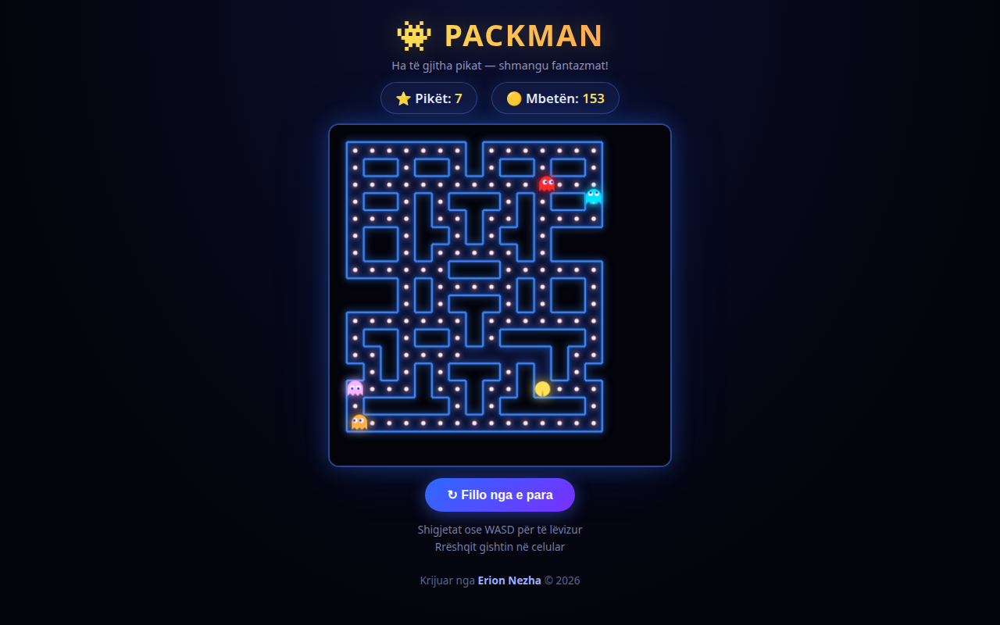

# 👾 Packman 🇦🇱

> Lojë arcade Packman me turtle graphics në Python — ha pikat, shmangu 4 fantazmat dhe grumbullo pikë.



**🔴 Live demo — shiko kodin:** https://erionnezha.github.io/Packman/


## 🎮 Kontrolli

| Shigjeta | Lëvizja |
|----------|---------|
| ⬆ | Lart |
| ⬇ | Poshtë |
| ⬅ | Majtas |
| ➡ | Djathtas |

## ▶️ Si ekzekutohet

```bash
pip install freegames
python packman.py
```

## 📄 Licenca

Copyright © 2026 Erion Nezha. Të gjitha të drejtat të rezervuara. Shiko [LICENSE](LICENSE).

---

# 👾 Packman 🇬🇧

> Packman arcade game with turtle graphics in Python — eat the dots, dodge the 4 ghosts and collect points.

**🔴 Live demo — view the code:** https://erionnezha.github.io/Packman/


## 🎮 Controls

| Arrow | Movement |
|----------|---------|
| ⬆ | Up |
| ⬇ | Down |
| ⬅ | Left |
| ➡ | Right |

## ▶️ How to run

```bash
pip install freegames
python packman.py
```

## 📄 License

Copyright © 2026 Erion Nezha. All rights reserved. See [LICENSE](LICENSE).
